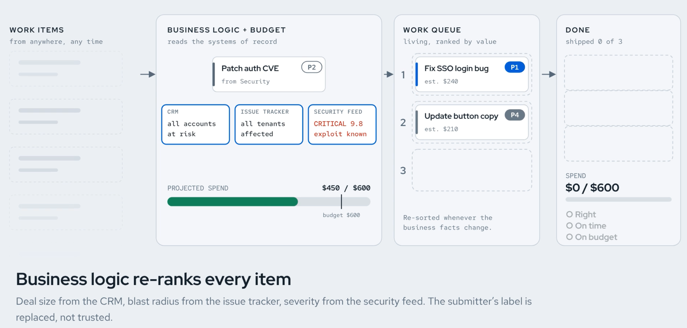

# First-Class Tokens



This repository is a presentation reference design for showing how business
facts can influence Kueue job priority through a model-backed intake
controller. It is not a supported product or a production-ready
business-priority service. Review the example policy, inputs, and model output
before adapting the design to real workloads.

## What it demonstrates

1. A namespaced `BusinessWorkItem` describes business facts and
   links to a Job in the same namespace.
2. The intake controller calls the structured decision endpoint served by a
   DiffusionGemma/vLLM deployment and validates the result against the
   configurable FarePolicy.
3. For a sufficiently confident decision, the controller updates the linked
   pending Job's Kueue priority label. It fails closed for low-confidence
   decisions and does not reprioritize admitted or reserved work.
4. Kueue reflects the priority in its generated Workload and continues to
   enforce queue capacity.

The main components are the `BusinessWorkItem` CRD, intake controller,
FarePolicy configuration, decision-model Deployment/Service, Kueue resources,
business fact corpus, quality gate, and KueueViz visualization manifests. The
example inputs, event updates, and expected classes are available in the
[work-item definitions](config/fixtures/business-work-items.yaml),
[business events](config/fixtures/business-events.jsonl), and
[expected outcomes](config/evaluation/expected-outcomes.yaml). See
[the high-level design](docs/high-level-design.md),
[cluster footprint and model-serving details](docs/cluster-footprint.md), and
[demo prerequisites](docs/demo-prerequisites.md).

## Try the demo

The full rebuild expects an OpenShift cluster with ready Kueue APIs, an
allocatable NVIDIA GPU, persistent storage for the model cache, cluster-admin
permissions, Docker, and outbound access to the public base-image and model
registries. It builds/pushes images to that cluster's integrated registry and
downloads model weights at runtime; the weights are not stored in this repo.

```sh
make test
make demo-check
make demo-rebuild
```

`make demo-rebuild` also enables/configures OpenShift User Workload Monitoring,
which is a cluster-level change and makes eligible ServiceMonitors in user
namespaces discoverable. Review [the prerequisites](docs/demo-prerequisites.md)
and [cluster impact](docs/cluster-footprint.md) before running it on a shared
cluster.

Useful lifecycle targets:

- `make demo-baseline` checks the capacity-held baseline.
- `make demo-fixtures-e2e` runs the repeated model quality gate and event/churn
  demonstration.
- `make demo-fixtures-clean` removes fixture state and restores the
  baseline while preserving the namespace and model cache.
- `make demo-down` deletes the demo namespace, including its model-cache PVC.
- `make demo-kueueviz-up` applies the optional KueueViz manifests, waits for
  OpenShift-generated Route hosts, and configures the frontend WebSocket and
  backend allowed origin from those hosts.

The image lock is intentionally cluster-local: its `pullSpec` entries refer
to this OpenShift cluster's internal registry. `make demo-rebuild` builds and
pushes images, then updates those digest references for the target cluster.
Do not expect the checked-in image pull specs to work from a different
cluster before rebuilding/relocking.

## Licensing and model terms

Project files are offered under the MIT License in [`LICENSE`](LICENSE). The
vendored `images/diffusiongemma/structured_server.py` retains its own vLLM
Apache-2.0 SPDX notice and pinned upstream source link; the repository MIT
license does not replace that file's license.

The repository does not contain model weights. It downloads the pinned
[RedHatAI DiffusionGemma model](https://huggingface.co/RedHatAI/diffusiongemma-26B-A4B-it-FP8-dynamic)
at runtime. The model card identifies the quantized model as Apache-2.0 and
names Google DiffusionGemma as its base; Google's [Gemma Terms of Use](https://ai.google.dev/gemma/terms)
and [Prohibited Use Policy](https://ai.google.dev/gemma/prohibited_use_policy)
also apply to model use. Review those terms before downloading or serving the
weights; this repository's MIT license does not license the model.
